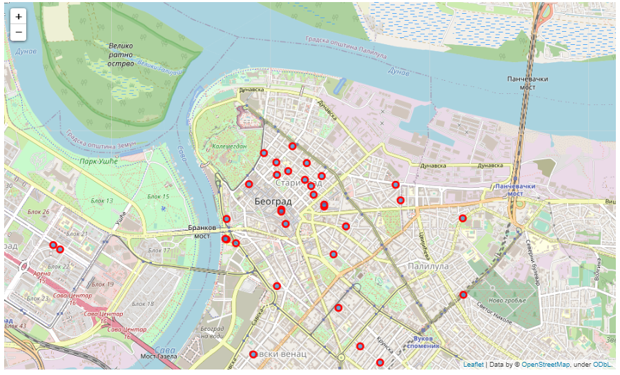
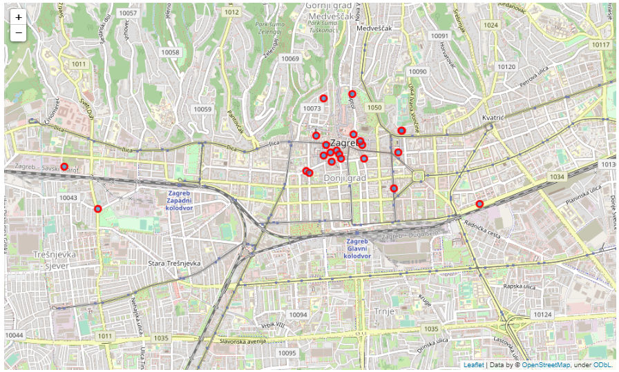
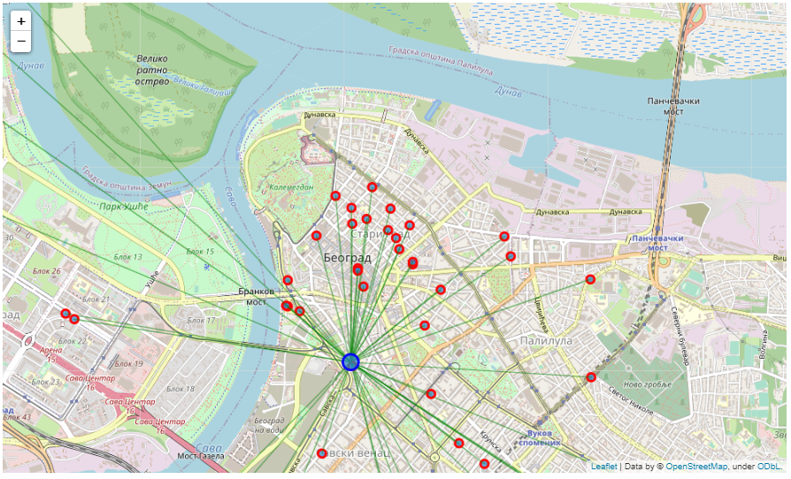
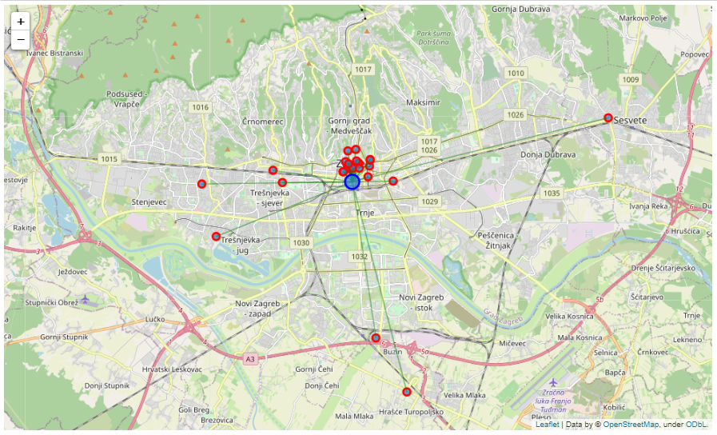

# The Battle of Neighborhoods - Final project 

## Introduction: Business Problem 

Welcome to my Peer-graded Assignment: Capstone Project - The Battle of Neighborhoods. In this section I will explain you the Business problem that I decided to solve using skills and competences that I gained during last 10 courses of Data Science Professional Certificate on Coursera.
Let`s imagine that I was contacted by famous Wine Bars Chain operating in different cities across Europe with goal to open first wine bar in Balkan region. They are currently in dilemma to open first bar in Belgrade, Serbia or Zagreb, Croatia. Therefore, they requested analysis about existing wine bars in downtown of both cities. As both cities are relatively similar when it comes to gastronomic offer, number of tourists and structure of city centre, they are interested in number of wine bars, its density and what would be best locations to open their wine bars.

## Data 

In order to solve business problem that I explained in first section I will retreat Dara using Foursquare API. As free account is limited to 100.
Data that will be retrieved are:
1. Name of the venue
2. Venue ID
3. Latitude
4. Longitude

## Methodology 

On the beginning data was obtained using Foursquare API wich gave us following information:
Total number of wine bars in Belgrade, Serbia is  51
Total number of wine bars in Zagreb, Croatia is  28
By the observation of the map we could see that density of wine bars in Zagreb is higher than in Belgrade. However, we needed prove for it. Mean Distance from Mean coordinates for each city was calculated.

Belgrade:

  

Zagreb:

  

## Result 

Belgrade, Serbia
Mean Distance from Mean coordinates
0.020989751460307772

  

Zagreb, Croatia
Mean Distance from Mean coordinates
0.02231054527921986

  

## Discussion 
Result of analysis shows that density of smaller number of wine bars in Zagreb, Croatia is bigger than in Belgrade, Serbia. However, we can observe that few venues are in suburbs of the city, while most of other bars are located in city centre. On the hand, in Belgrade bars are distributed evenly around wider are of the city centre. Additional analysis and change of criteria can be done on available data in order to obtain more precise result.

## Conclusions 
Here are few conclusions that can help solve our business problem:
- Belgrade has more wine bars than Zagreb
- Most of wine bars in Zagreb are located in strict city center
- Location of new wine bar in Zagreb pays bigger role in success of the business than in case of Belgrade

[Presentation of the project is on this link](https://github.com/vjslvvjc/The-Battle-of-Neighborhoods/blob/main/BoN%20week%202.pptx)
[Notebook of the project is on this link](https://github.com/vjslvvjc/The-Battle-of-Neighborhoods/blob/main/BoN%20week%202.ipynb)

